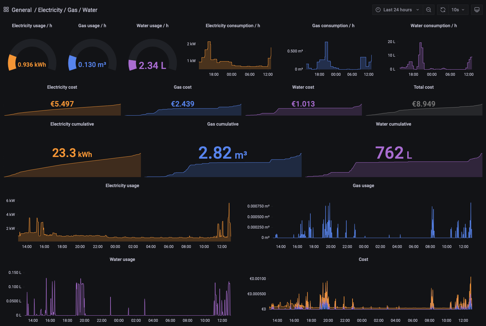

# Gas, water and electricity consumption dashboard



## Requirements
- Smart metering system
- [P1 wifi gateway][p1-gateway] 
- [Watermeter Gateway][water-meter-gateway]
- [Raspberry Pi 4+][pi]
- [64 bit Raspberry Pi OS ][pi-os]
- [Grafana][grafana] 
- [Influxdb][influxdb]
- [Telegraf][telegraf]
- [Mosquitto][mosquito]

## Overview
```
P1 wifi gateway via MQTT --> Mosquitto <-- Telegraph
                                               |
                                               V
                                            Influxdb
                                               ^
                                               |
                                            Grafana
```

## Instalation

### Preparing you Raspberry Pi
Download the [64 bit Raspberry Pi OS ][pi-os] and image your sd-card with [Raspberry Pi Imager][pi-imager] or [BalenaEtcher][balena-etcher].

### Add the Grafana repository 
```
$ wget -q -O - https://packages.grafana.com/gpg.key | sudo apt-key add -
$ echo "deb https://packages.grafana.com/oss/deb stable main" | sudo tee -a /etc/apt/sources.list.d/grafana.list
```

### Install Grafana and Mosquitto
```
$ sudo apt-get update
$ sudo apt-get install grafana mosquitto
```

### Enable and setup Mosquitto
```
$ sudo /bin/systemctl enable mosquitto
$ sudo /bin/systemctl start mosquitto

$ sudo touch /etc/mosquitto/passwd
$ sudo mosquitto_passwd -b /etc/mosquitto/passwd mosquitto mosquitto
```

Add the `mosquitto.conf` and restart.
```
$ sudo mv mosquitto.conf /etc/mosquitto/conf.d/mosquitto.conf
$ sudo systemctl restart mosquitto
```

### Install and start InfluxDB
```
$ wget -qO- https://repos.influxdata.com/influxdb2.key | sudo apt-key add -  
$ wget https://dl.influxdata.com/influxdb/releases/influxdb2-2.0.9-arm64.deb
$ sudo dpkg -i influxdb2-2.0.9-arm64.deb

$ sudo /bin/systemctl enable influxd
$ sudo /bin/systemctl start influxd
```

You can now access the influxDB at: `http://<ip address>:8086` with `admin` as user and password.  
Add a bucket and generate an access token for Telegraf and Grafana.

### Install and setup Telegraf
```
$ wget https://dl.influxdata.com/telegraf/releases/telegraf_1.20.2-1_arm64.deb
$ sudo dpkg -i telegraf_1.20.2-1_arm64.deb

$ sudo /bin/systemctl enable telegraf
$ sudo /bin/systemctl start telegraf

$ sudo mv /etc/telegraf/telegraf.conf /etc/telegraf/telegraf.org
```

Edit the `telegraf.conf` and add your influxdb token and bucket.
Add the `telegraf.conf` and restart
```
$ sudo mv telegraf.conf /etc/telegraf/telegraf.d/smart_meter.conf
$ sudo /bin/systemctl restart telegraf
```

### Enable and start Grafana
```
$ sudo /bin/systemctl enable grafana-server
$ sudo /bin/systemctl start grafana-server
```
You can now access Grafana at: `http://admin:admin@<ip address>:3000`.  

Add the InfluxDB as a new datasource, edit the `dashboard.json` and replace the bucketname "smart_meter" with your bucket name and import it.

[p1-gateway]: https://smartgateways.nl/product/slimme-meter-wifi-gateway/
[water-meter-gateway]: https://smartgateways.nl/product/slimme-watermeter-gateway/
[pi]: https://www.raspberrypi.com/products/raspberry-pi-4-model-b/
[pi-os]: https://downloads.raspberrypi.org/raspios_lite_arm64/images/
[pi-imager]: https://www.raspberrypi.com/software/
[balena-etcher]: https://www.balena.io/etcher/
[grafana]: https://grafana.com
[influxdb]: https://www.influxdata.com
[telegraf]: https://docs.influxdata.com/telegraf/
[mosquito]: https://www.mosquitto.org
